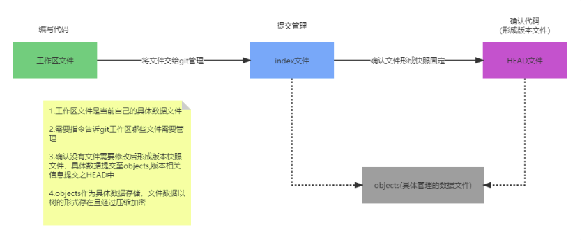

## 工作区文件

   工作区文件是指当前自己的具体的数据文件
## index文件
   
   需要指令告诉git工作区哪些文件需要管理
## HEAD文件

   确认文件没有需要修改后形成版本快照文件
   
   具体数据提交到objects 版本相关信息提交至HEAD中
## objects文件
 
   这里作为具体数据存储 文件数据以树的形式存储 且经过压缩加密

## 本地git库详解

!(主要结构)[img-structure.png]

- 工作区

  本地正在开发的代码

- 暂存区

  与工作区代码文件位置照应 且经过add后具体数据编译成元文件存储在objects下的数据索引

## git常用命令

- git add

  添加文件到暂存区

	- 添加当前文件到暂存区
		git add .
	- 添加单个文件或者多个文件到暂存区
		git add file1 file2 。。。

- git commit

  提交文件到本地仓库
  git commit -m “提交信息”

- git status

  查看仓库当前的状态 显示有变更的文件

  文件前缀A表示已经进行add

  文件前缀为AM表示已经进行add后被修改

  文件前缀M表示已经进行commit后被修改 

